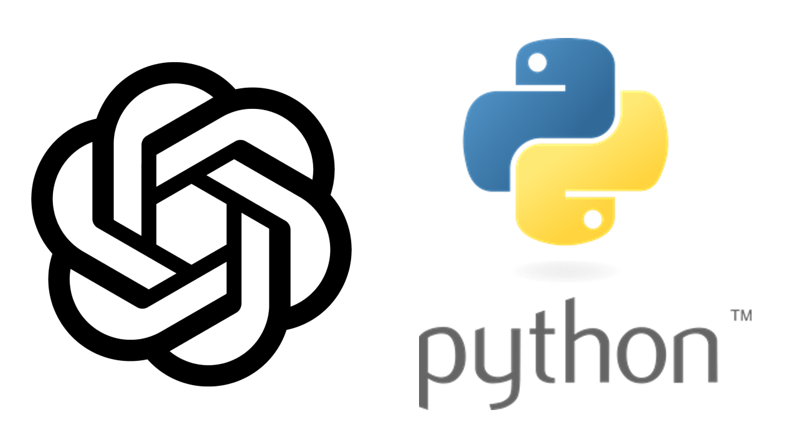
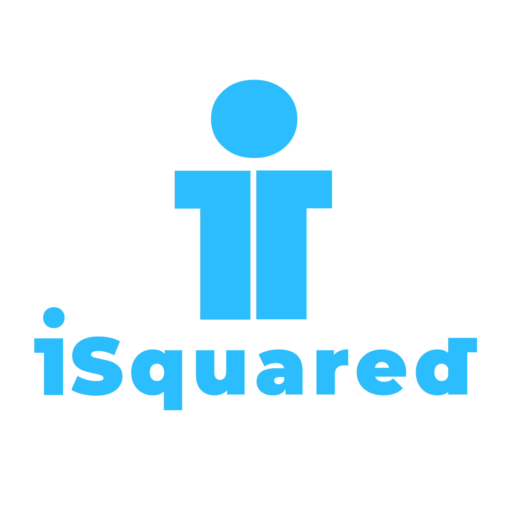

# The 100-page ChatGPT Generated Python Tutorial
## For Absolute Beginners


<center>

</center>


Programming is learned by programming. For this reason we need a set of explained exercises and program them in order to learn how to program. This document was created with this premise in mind.

To generate the content of this document we used two resources:
- A pre-compiled list of Python exercises and
- The [ChatGPT](https://openai.com/blog/chatgpt/) Large Language Model


The exercises in this documents were taken from the  [Break The Ice With Python](https://github.com/darkprinx/break-the-ice-with-python) GitHub repository. The repository contains more than 100 simple Python exercises aimed for beginners.

[ChatGPT](https://openai.com/blog/chatgpt/) is a revolutionary large language model. It is capable of generating text on literally any subject. The model is quite good in generating explanations of code snippets. This serves as a good tool to teach programming as demonstrated in this document.\\

To obtain the code explanations we prompted ChatGPT with the following prompt:\\

```
Explain me the following code snippet written in Python as explaining it to someone who doesn't know programming in Python
```

after which the coding exercise in Python followed.

All the exercises can be found in this repository in the directory [exercises](./exercises). Read more about this project on [iSquared.digital](https://isquared.digital/blog/2023-01-29-chat-gpt-generated-python-tutorial/)


<center>

</center>